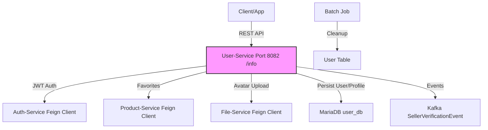

# User-Service - Quản Lý Người Dùng & Profile

[](https://github.com/shopping-ecommerce/user-service/actions) [](https://codecov.io/gh/shopping-ecommerce/user-service) [](LICENSE) [](https://spring.io/projects/spring-boot) [](https://openjdk.org/)

## 📋 Mô Tả
User-Service là một microservice backend quản lý thông tin người dùng, profile, địa chỉ, và favorites cho ứng dụng e-commerce. Xây dựng bằng **Spring Boot 3.x**, sử dụng **MariaDB** làm database chính (user_db), tích hợp **Feign** để gọi các service khác (Auth-Service cho role, Product-Service cho favorites, File-Service cho avatar upload). Service hỗ trợ CRUD user, quản lý address (add/update/delete/set default), favorites products, và upload avatar (multipart file lên đến 50MB).

Dự án tập trung vào bảo mật (JWT integration, RBAC với @PreAuthorize), scalability (Feign clients với timeout config), và logging chi tiết (DEBUG cho Feign và services).

### 🏗️ Architecture
Kiến trúc microservices với User-Service làm core cho profile management. Các thành phần chính:
- **Communication**: REST API, Feign clients (Auth, Product, File), Kafka cho events (SellerVerificationEvent).
- **Database**: MariaDB (JPA/Hibernate).
- **Security**: JWT (OAuth2 Resource Server), Method Security.
- **Deployment**: Docker + Kubernetes (giả định), port 8082 (context-path: /info).


## ✨ Tính Năng Chính
- **User Management**: CRUD users (create/update/delete/batch delete), search by query, get by ID/account/my profile.
- **Profile Updates**: Update profile info, upload avatar (MultipartFile, max 50MB).
- **Address Management**: Add/update/delete/set default addresses.
- **Favorites**: Add/remove favorite products, get list by user ID (integrate Product-Service).
- **Authorization**: Role-based (ADMIN for CRUD, UPDATE_USER for updates), public endpoints (/profiles/create, search sellers).
- **Integration**: Feign clients cho Auth (assign/revoke role), Product (search/delete), File (upload). Kafka events (SellerVerificationEvent cho APPROVED/REJECTED).
- **Error Handling**: Standardized ApiResponse, JWT entry point cho unauthorized.

## 🛠️ Tech Stack
| Component          | Technology                  | Details                                      |
|--------------------|-----------------------------|----------------------------------------------|
| **Language/Framework** | Java 17+ / Spring Boot 3.x | REST Controllers, JPA, Security              |
| **Database**       | MariaDB                     | JPA entities (User, Address, Favorites?)     |
| **Messaging**      | Apache Kafka                | SellerVerificationEvent (sellerId, status, reason) |
| **Security**       | Spring Security (OAuth2)    | JWT decoder, @PreAuthorize, Custom EntryPoint |
| **Client**         | OpenFeign                   | AuthClient, ProductClient (Jackson codec, timeout 30-60s) |
| **File Handling**  | Multipart/Spring Servlet    | Avatar upload (max 50MB file, 100MB request) |
| **Utils**          | Lombok, Jackson, ObjectMapper | DTOs, JSON logging, JavaTimeModule           |
| **Logging**        | SLF4J/Logback               | DEBUG cho Feign/services, pattern console    |

## 🚀 Cài Đặt & Chạy
### Yêu Cầu
- Java 17+ / Maven 3.6+.
- Docker (cho MariaDB, Kafka).
- Environment vars: `DBMS_CONNECTION`, `JWT_SIGNERKEY`, `FEIGN_AUTH` (http://auth-service:8080), `FEIGN_PRODUCT` (http://product-service:8083), `FEIGN_FILE` (http://file-service:8084) (xem application.yml).

### Bước 1: Clone Repo
```bash
git clone https://github.com/shopping-ecommerce/user-service.git
cd user-service
```

### Bước 2: Setup Môi Trường
```bash
# Copy env files (nếu có example)
cp src/main/resources/application.yml.example application.yml

# Build project
mvn clean install

# Setup Docker services (MariaDB, Kafka)
docker-compose up -d  # Sử dụng docker-compose.yml nếu có
```

### Bước 3: Chạy Service
```bash
# Run với Maven
mvn spring-boot:run

# Hoặc JAR
java -jar target/user-service-*.jar
```

- Port mặc định: **8082** (context: /info, e.g., http://localhost:8082/info/profiles/...).
- Test endpoints: Sử dụng Postman/Swagger (http://localhost:8082/info/swagger-ui.html nếu enable).

Ví dụ test get user:
```bash
curl -X GET http://localhost:8082/info/profiles/{id} \
  -H "Authorization: Bearer <jwt-token>"
```

### Bước 4: Test & Debug
```bash
# Run tests
mvn test

# Check logs (DEBUG cho Feign)
tail -f logs/application.log  # Hoặc console (pattern: %d{yyyy-MM-dd HH:mm:ss}...)
```

- Public: /profiles/create (POST), /sellers/searchByUserId/** (GET).
- Auth required cho hầu hết (ADMIN cho delete, UPDATE_USER cho update).

## 📚 Tài Liệu
- **API Docs**: Sử dụng SpringDoc OpenAPI (Swagger UI tại `/swagger-ui.html`).
- **Endpoints** (base: /info/profiles):
  | Method | Endpoint                          | Description                  | Auth Required    |
  |--------|-----------------------------------|------------------------------|------------------|
  | GET    | `/profiles`                       | Lấy tất cả users             | Yes (ADMIN)      |
  | GET    | `/profiles/{id}`                  | Lấy user by ID               | No               |
  | GET    | `/profiles/search?q=query`        | Search users                 | No               |
  | POST   | `/profiles/create`                | Tạo user                     | No               |
  | POST   | `/profiles/updateProfile`         | Update profile               | Yes (UPDATE_USER)|
  | DELETE | `/profiles/{id}`                  | Delete user                  | Yes (ADMIN)      |
  | POST   | `/profiles/address/add`           | Add address                  | Yes              |
  | POST   | `/profiles/favorite/add`          | Add favorite product         | Yes              |
  | GET    | `/profiles/favorite/{userId}`     | Get favorites                | Yes              |
  | POST   | `/profiles/updateAvatar`          | Upload avatar (multipart)    | Yes              |
- **Deployment Guide**: Xem `docs/deploy.md` (Kubernetes manifests cho microservices).
- **Contributing Guide**: Xem `CONTRIBUTING.md`.

## 🤝 Đóng Góp
- Fork repo và tạo PR với branch `feature/[tên-feature]`.
- Tuân thủ code style: Checkstyle, Lombok annotations.
- Test coverage >80% trước merge.
  Pull requests welcome! Báo issue nếu bug hoặc feature request.

## 📄 Giấy Phép
Dự án này được phân phối dưới giấy phép MIT. Xem file [LICENSE](LICENSE) để biết chi tiết.

## 👥 Liên Hệ
- Author: [Hồ Huỳnh Hoài Thịnh] ([@github-hohuynhhoaithinh](https://github.com/hohuynhhoaithinh))
- Email: [hohuynhhoaithinh@gmail.com]

---

*Cảm ơn bạn đã sử dụng User-Service! 🚀*